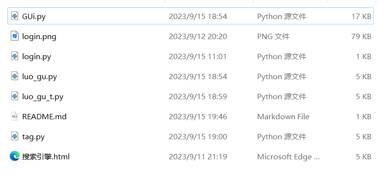
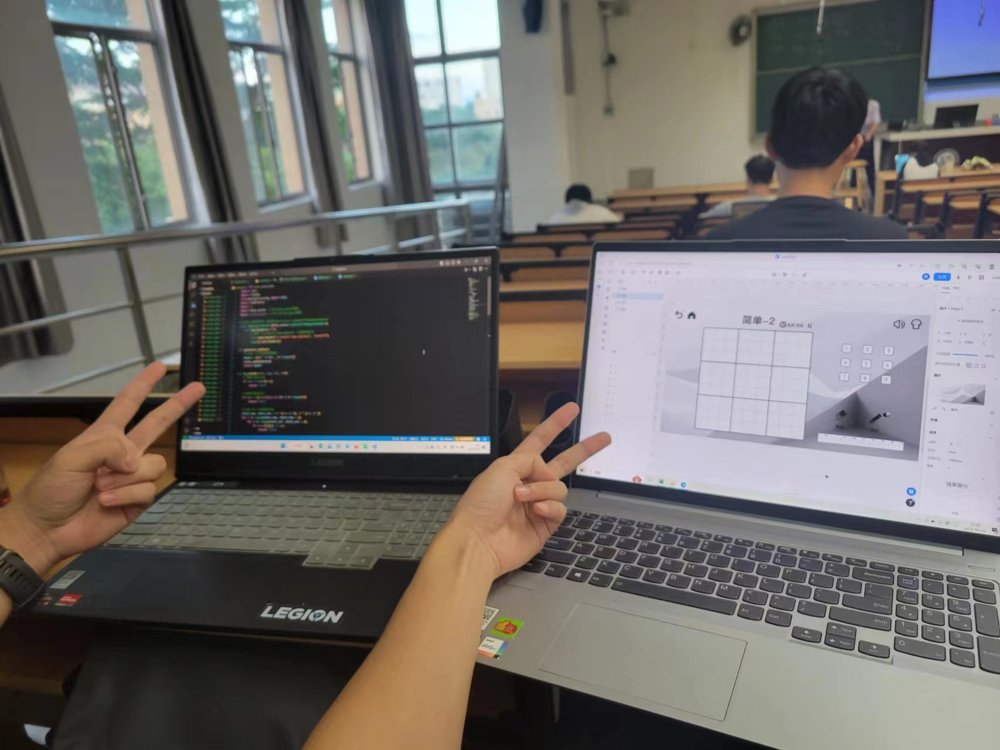

# 迷糊的软工之旅

因为感觉时间过的太快，而觉得一切是那么的模糊。可能事太多了，脑子给我把信息删了些。

## 一、学期回顾

### 1.1 回顾软件工程课程的想象

**初始期望：** 在这门课程中，我期望能够全面了解软件工程的实践，提升编码和团队协作能力。

回顾目前的所学所练所得，发现在需求分析、设计、编码以及团队协作等方面得到了一定的提升😎。

### 1.2 投入与产出

在软工实践课程中，我编写了少说也有千行代码了。

在团队项目中，我初期扮演了剧情策划的角色，中后期扮演的代码写手的角色，总之是参与感满满了。

各次作业的时间投入如下：

| 时间        | 作业                             | 花费时间 |
| ----------- | -------------------------------- | -------- |
| 09.01~09.08 | 第一次个人作业                   | 20h      |
| 09.08~09.15 | 第二次个人作业                   | 56h      |
| 09.15~09.28 | 第一次结对编程作业               | 32h      |
| 09.28~10.07 | 第二次结对编程作业               | 24h      |
| 10.07~10.23 | 团队介绍、选题报告、需求分析报告 | 16h      |
| 10.23~11.03 | 原型设计、概要设计               | 16h      |
| 11.04       | 团队现场编程                     | 4h       |
| 11.04~11.18 | 团队项目Alpha冲刺阶段            | 48h      |
| 11.22~12.16 | 团队项目Beta冲刺阶段与终期总结   | 10h      |
| 12.08~12.17 | 个人学期总结博客作业             | 3h       |

| 累计时间 | 实际周均时间 | 预计周均时间 |
| -------- | ------------ | ------------ |
| 229h     | 14.84h       | 16h          |

1.3 令我印象最深刻的必然是最后的团队作业了

在这次的团队作业，我自我感觉是”当牛做马“，做的事倒是挺多的，人也是挺累的，只能说打破了我对做游戏的幻想，做游戏哪有玩游戏快乐，做出来的游戏，前期跑出来一堆奇怪的bug，写项目也是几次代码被爆破，只能把历史提交的记录复制一份，重新从提交的时候的部分，开始修改，一个字”绝“，多么美妙的体验啊，失败的痛苦，在我第一次项目爆破的那一瞬间，我想吐，在我找到解决办法的时候，我是多么的开心啊，终于不是要重新再来一边了😎，带给我的熬夜，带给我修bug的痛苦，我怎么可能不深刻，那句话是对的，痛苦的事总是记的那么的清晰，也许多年以后，我会和我的同事，我的朋友吐槽，我还记得当年的软工实践的写游戏的那次带给我的记忆。

## 二、总结收获

### 2.1 软工实践故事

我的软工实践故事还得从遥远的23/09/01说起，我已经记不清那天的天气了，也许是阳光明媚的一天，开始了这一段奇妙的旅行，第一个作业便是搭建个人网站，我可以说是充满干劲，对网页的内容那是想把我的所有经历那是都写进去，好的，说到这些那就不得不提起2023/12/14，我想将最后一次博客的任务写到我的个人网站上去，因为操作不当，好的我写的文件全部丢失了，是痛苦的，于是我快速的花了一上午，重新编写了我的网站，下面展示展示成果，第一个博客栏目便是我要发我的最后一篇实践的博客内容。

很好说到这里，我的第一次作业也没什么好说的了，稍微总结，就是我表示很满意，并且将来还会继续用到，记录我的生活。

第二次作业就是爬虫了，我不去看，我都不会忘记是做的爬虫，当然也不会这么快忘记，爬虫怎么说呢，应该是我的第一次比较“成熟”的去面对页面的展示和去使用网页的开发者工具去看网页中的各种标签，同时也是我全新的接触到了人工智能，我能说的就是chatgpt真的是帮大忙了,直接网页去把洛谷的网页html代码复制下来，直接让gpt转成gui代码。

第一次结对作业和第二次结对作业，怎么说呢，基本我们在第一次的结对作业就将第二次的结对作业全部搞定，好像就是除了那个并发的是没有在第一次实现，第二次基本做的就是这个事，再就是优化了一下整体界面，感觉挺轻松的，毕竟网页的问题给gpt就行，生成的逻辑也给gpt就行，面向gpt编程，只需要好好沟通，自己筛选出正确的代码部分，添加到自己的部分，再结合自己的理解，感觉写的还是挺轻松的。

团队作业，那这个总结可以就浅浅的总结一下吧

体会自然就不说什么收获颇丰之类的话语了，说点更加现实的，那就是一个字累，事很多，要做的也很多，改bug改的也很头疼，有的时候，是一改改一天，虽说后面熟练后，这方面的困难和压力也在逐渐减少，只能说好吧，哥的能力确实被迫提升了，没有自豪感，虽然有丢丢成就感，可是不多，很快就消散了，被各种需求以及后面其他考试的压力让我根本没有时间去觉得自己又可以了
收获的话，那不说，我对于需求分析的编写，可以说是熟练了一些些，对于游戏开发的一些流程也熟悉了一点，只能说某些能力的提升那是只可意会不可言传，可能就是那综合能力吧，说不定在未来的一天，我会恍然大悟，原来我这方面的得心应手，全是那次的软工实践带给我的因啊。

图片就不放了，可能别人不愿意露脸呢。

### 2.2 学到的新技术与工具

- 新技术

1. 说到新技术，那第一个就是python和html了，在团队作业之前，只要用到的就是这两个技术，编写爬虫，开发网页游戏，都是要用到python的，python实在是太好用了，html也学习了很多，以及js和css，对页面的渲染，也是帮助了我其他的课程作业了。
2. 再就是对于github的使用了，现在也是可以比较正常的使用github了，刚开始也是因为不熟悉的使用，犯了一些让人爆炸的错误，也是让我熟悉了团队编程的操作。

- 工具

1. 学到的生产力的工具那就是chatgpt了，他无时无刻不出现在我的所有实践过程中，除了第一次，他帮我解决了我初期什么都不会，却什么都想写的尴尬境地，以及后面会写点东西的时候，他又变成了我最好的沟通对象，与他沟通来轻松的实现我想要的功能，而不用像开始只能反复的去让他修改，自己那是看不懂一点点，所以说来他带给我的帮助是全程的，也是最主要的。

2. 接下来就是我们的老朋友了，那就是哔站，不会的就搜视频，直接看教学视频，真的是太棒了，学会的之前，就是模仿，给我带来的帮助也是不能忽略的。

3. Github Desktop很好的帮助我把项目内容上传到github上面，免去了命令窗口的操作。

### 2.3 技术之外的提升

- 除了技术方面，那就是团队合作、沟通协调等方面也有了显著提升，毕竟你不沟通好，那别想做完这个项目了，说不定你做的东西就不小心把别人的破坏了，所以在一些修改前，还是要进行合理的沟通的。
- 再就是前面总结所说的妙不可言的综合能力了，说不定以后会切身实际的感受到。

### 2.4 其他想说的

- 确实是一段宝贵的学习经历，真的也是比较充实的，感觉怎么这么快就要放假了，软工实践有主要功劳。应该是提升了我的一些实力吧，自己真的很难在目前切实的感受到。

- 最遗憾的是，我把自己的网站爆破了，于是我重写了一次😎。
- 还有就是未来的学弟学妹们，你们不能享受到做游戏的快乐了，因为栋哥说游戏不能合理的将代码工作分配到每个人，就看未来的学长和栋哥能给你们带来什么“有趣”的项目了😁。

## 三、致谢

在这个学期的软工实践中，我要特别感谢结队队友和团队成员，没有他们的支持与合作，我不可能比较顺利的完成这些项目。同时也要感谢的学长学姐们，记忆比较深刻的就是对每个小组游戏给出了他们的建议的场景，还有老师，给我们一个能切身锻炼到自己综合能力的机会。

我想对我的编程队友说的是终于写完了🥳。

最后，感谢这段迷糊的软工之旅，让我在其中成长、学习、收获。希望未来的自己能够继续保持对项目开发的热情，不断进步。
